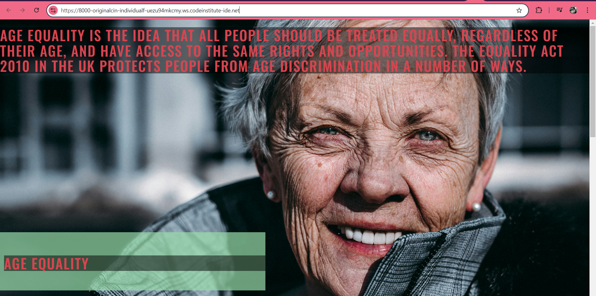
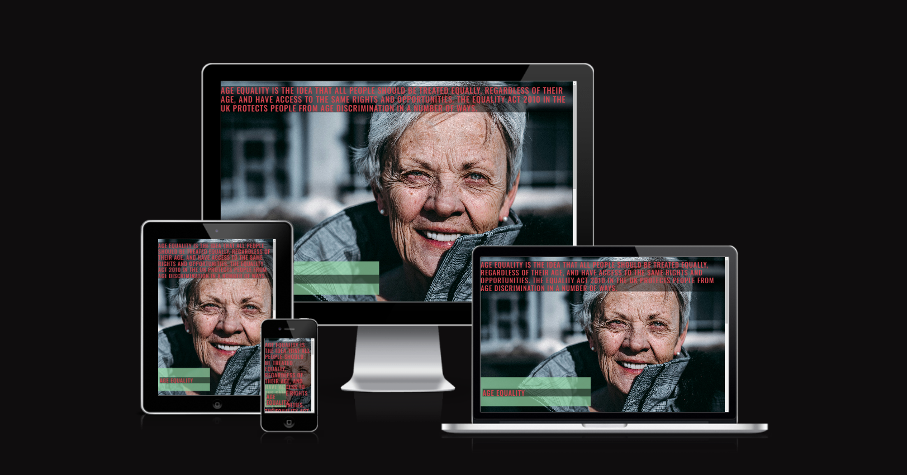
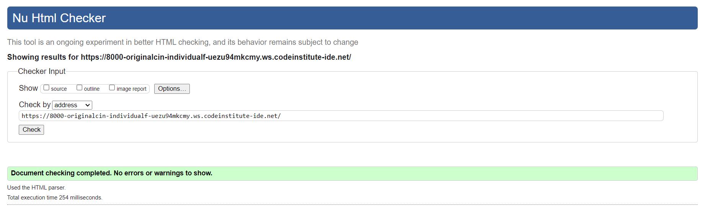
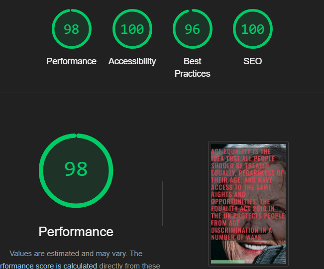

# Age Equality
SCREENSHOT OF HOME PAGE

Am i responsive

## CONTENTS
PURPOSE

The purpose of this project is to raise awarness of age equality in the workplace and the education sector. It is important that we as a society educate ourselves on a  myriad of issues which arise in everyday life.
The project will aim to educate those willing to learn and understand and in turn become an ally.

A brief description of the project's purpose, what it aims to achieve, and the value it provides to the users.
Guidance: Begin filling out this section during Phase 1: Ideation & Initial Setup. Clearly articulate the main goal of your project, what it aims to achieve, and how it will provide value to your target audience.

Target Audience

The intended audience is anybody who wishes to understand more about the subject of age equality and learn how they can help to change the mindset of individuals in society and in turn make the world a more understanding and supportive place.

Identify the target audience for your website and explain why this audience will benefit from the project.
Guidance: Use this section to identify who will benefit from your project and why. This should be informed by your user stories and overall project objectives.
### USER EXPERIENCE
First Time Users
New users will find a friendly and easy to use website.
New users can asscess all pages and information from the navigation section found at the top of the page.
New users will find a button which will take them directly to the Age Equality act 2010 webpage.

Returning Users
Returning users can easily find and re-read the information for help.
Returning users can easily find ways to share the information to friends or family member.

#### CREATION PROCESS

1. Strategy
To create a website that is user friendly and easy to use for people of all proficiencies. 
The website must be easy to read and undertand from both prospectives.
The website needs to be easy to navigate.
Users will require mobile responsiveness to make it easy to access anywhere.
2. Scope
The website should be accesible on all devices.
3. Structural
The website is easy to use for all levels and does not require too much technical level. Making it user friendly.
4. Skeleton
This website has been formulated to hightlight the societal issues of age equality and how we can work together to combat this and make people feel inclusion.

The Navagation bar will be found at the top of the webpage.
The (Hero Image) logo will show be shown on the landing page.
The text will be large enough to easily read and if nessasery letter space. 

WIREFRAMES

DESIGN

Colour Pallette 

 
 I chose these colours as i felt they worked well visually. It took quite a while to find the right combination which would not clah with the the complexion of the woman in the hero image.

Typography
I chose san serif fonts as they work the best in media and print documents

For headers and footers

Google Fonts was used to import ozwald font For the rest of the site.

IMAGERY
I chose the image of a happy and smiling mature woman with a full smile. I chose this image because this lady looks like the embodiment of happiness and enjoying oneself as we get older.

PAGE FEATURES
At the top of the page i have a hero image and some text which highlights what age equality is

Hero Image
happy smiling older woman
Footer
Age equality Desktop Footer
Tablet & Mobile View
Hero Image

I kept the differences to a minimum to ensure the site remains user friendly.

**Mobile View **

LANGUAGES USED
HTML5
CSS3 -JavaScript

Frameworks, Libraries, Technologies & Programs Used
Balsamiq - used to create wireframes.
GitHub - used to save and store all files.
Git - used for version control.
GitPod - used as a workspace.
Google Fonts - fonts were chose imported from here
Font Awesome - icons and their associated kit were downloaded from here
Cooler - for all color palettes and accessibility contrast ratios
Dev Tools - to debug and for testing responsivenesse
W3C Validator - for validating the HTML and CSS code
unsplash.com for royalty free images

Testing
 Galaxy Fold - Dev Tools

Tablet - Ipad - Dev tools

laptop - 15 Inch Screen laptop - 17 Inch screen

Ultra wide monitor - 34 Inch 3440x1440

Testing browsers

Chrome
Edge
HTML Validation using W3C Validation
index.html
 

CREDITS

special thanks go to John Rearden for answering all of my questions, however big or small. geoff Fletcher for helping me. And Shelly Maughan for always being on hand in times of need.
