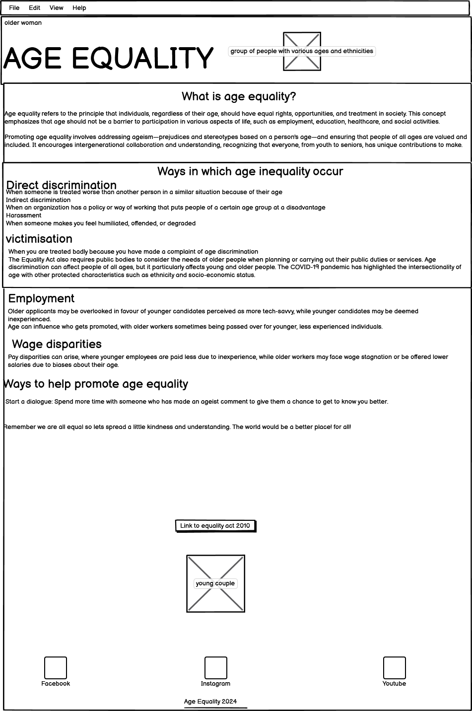
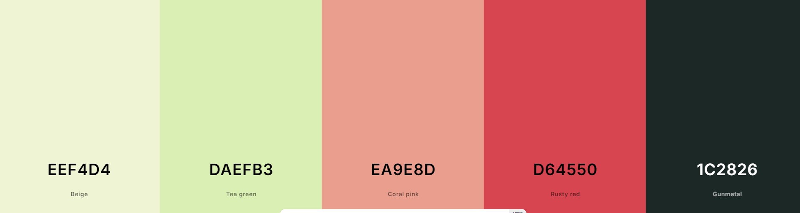

# Age Equality

## CONTENTS
Purpose
The purpose of this project is to raise awarness of age equality in the workplace and the education sector. It is important that we as a society educate ourselves on a  myriad of issues which arise in everyday life.
The project will aim to educate those willing to learn and understand and in turn become an ally.

A brief description of the project's purpose, what it aims to achieve, and the value it provides to the users.
Guidance: Begin filling out this section during Phase 1: Ideation & Initial Setup. Clearly articulate the main goal of your project, what it aims to achieve, and how it will provide value to your target audience.

Target Audience
The intended audience is anybody who wishes to understand more about the subject of age equality and learn how they can help to change the mindset of individuals in society and in turn make the world a more understanding and supportive place.

Identify the target audience for your website and explain why this audience will benefit from the project.
Guidance: Use this section to identify who will benefit from your project and why. This should be informed by your user stories and overall project objectives.
### USER EXPERIENCE
First Time Users
New users will find a friendly and easy to use website.
New users can asscess all pages and information from the navigation section found at the top of the page.
New users will find a button which will take them directly to the Age Equality act 2010 webpage.

Returning Users
Returning users can easily find and re-read the information for help.
Returning users can easily find ways to share the information to friends or family member.

#### CREATION PROCESS

Colour Pallette 

1. Strategy
I need a website that is friendly and inviting to both people with and without ADHD.
The website must be easy to read and undertand from both prospectives.
The website needs to be easy to navigate.
Users will require mobile responsiveness to make it easy to access anywhere.
2. Scope
The website needs to be available on multipul device sizes to allow users to get to the information at anytime from any device.

A selection of text that are known to be easy to read.
The site needs information on ADHD from the prospective of both sides. *The information needs to come across as informative and not like the blame is being pushed one way.
The website needs to be friendly and not offencive to anyone with or without ADHD.
3. Structural
This website will be simple to use and easy to navigate for all ages. Accessale and functional on m ultipul screen sizes.

Easy to find navigation and what page you are currently on.
Any buttons and links will highlight on hover to make them easy to reconize as clickable.
Navigation and footer bar will be on every page to make the layout easy to contiuly use.
To keep the same page layout to make the website feel like a safe space.
4. Skeleton
This website is being developed to be simple to use and naviagte. To show information that could help bring people closer togther with less conflicts.

The Navagation bar will be found at the top of the webpage.
The (Hero Image) logo will show be shown on the landing page.
The text will be large enough to easily read and if nessasery letter spaceings will be used
The information will be given from the persepctive of someone with ADHD but made easy to understand from a non Neuro-Spicy side
##### 
